# Meddit - Blog


[Site Live link](https://project4-matt-ci.herokuapp.com/)

I recommend clicking any links found in this README with Ctrl + Left mouse click for (Windows) and Control + click (Mac) 
# Project Introduction

This website is a fullstack application using mainly the Django fullstack web framework.

My Goal is to create a functioning and responsive Blog, that allows users can make blog posts. Users can also up vote and down vote as well as make comments.

The Sites purpose is to allow users to connect with each other, and share things they find interesting like hobbies or news!

I have built this project with the future in mind, as I have many plans to expand, improve, modernise design, technology, styling and featureset.

Project 4 for [CodeInstitute](https://codeinstitute.net/) Full stack course (5P)


 * This project is created using:
  1. Django 3.2
  2. Heroku (Deployment)
  3. Heroku PostgresSQL
  4. Bootstrap 5
  5. Github (Repository Hosting)
  6. Gitpod (Development environment)

  * Blog site allowing users to:
  1. Create | Edit | Delete Posts
  2. Create | Categories
  3. Create | Comments
  4. Login | Register | Logout
  5. Create | Update | User Profile

# User Experience
  ### User Stories
   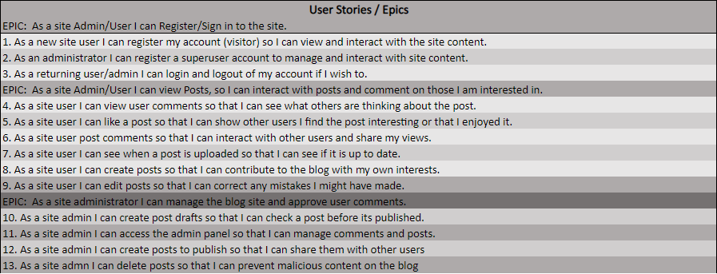

  * I have taken an Agile approach to making my user stories and epics, I would like to greatly expand on this approach in future projects as I gain experience.
  
    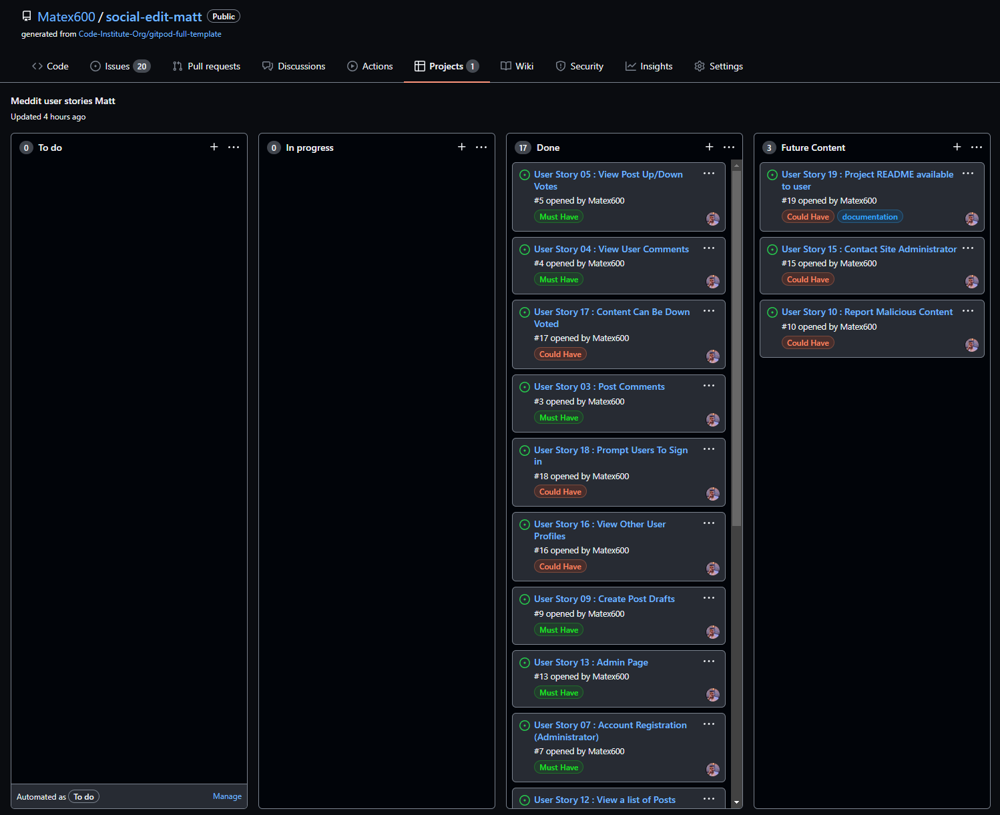

  * Steps Taken:

    1. Created issue tags showing varying importance to the project.

    2. Created issues with tags: 'Must have' (Most important features) 'Should have' (Should be implemented) 'Could have' (Implement if there is time) 'Won't have' (Features that have been outside of current scope)

    3. Created Github Project (Old version) at the time of submission; a new version of Github project has been released, I will implement this new version in future projects.

    4. I created a project with columns 'to do' (Work that needs to be done), 'In progress' (Feature in development), 'Done' (Feature complete and tested), 'Future content' (Content implemented post release).

    5. I then assigned 'issues' to the project as development continued, making decisions a long the way.

    ### Significace and Complexity 
    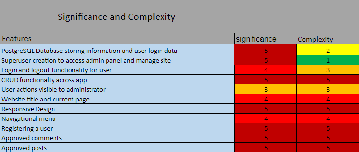 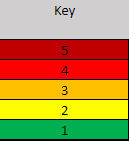

    6. All of the above has been implemented successfully.

  ### User testing 

  * I have recieved feedback from my mentor on my project, and I decided to adjust some styling to improve card colours for blog posts. I made them a lighter color to complement the rest of the site.

  * I have recieved feedback from my sibling, that enabled me to identify an issue with an image not aligning properly in the blog details therefore it has been patched.

  * I used the code review channel on slack and recieved feedback to help improve user experience, by adding an add post button if a category has no posts to make it easier for the user. This has been implemented.

  * I have tested the site functionality and created a non-admin account.

    * Testing:
      * login/register
      * creating post / category
      * commenting and liking posts

    All of these features worked as expected

  * I asked my sibling to assess the site functionality such as creating a post, category and after registering to test login functionality, and logout as well as creating and editing a profile, those features worked as expected.


  # Site Design

  ## Composition

  
  ### Fonts 

  * [Roboto](https://fonts.google.com/specimen/Roboto). - Font used for Body text.
  * [Roboto - Slab](https://fonts.google.com/specimen/Roboto+Slab?query=roboto+slab). - Font used for Header text.

  * I have chosen these two fonts, as they compliment eachother which additionally compliment my blog.

  * Sans-Serif is used as a backup font incase one or both fail for any reason.
  ### Font Size
    
  * I have kept font size as default as I feel that it looks good, and what I wanted for the blog I have no need to change it.

  ### Color Scheme

  * color: #ffff01 | Highlighting Navbar links, for good accessability and indicates to user that they are hovering over a link.

  * color: #FFFFFF | Is used for text color within the navbar, blog titles on index, blog description, date, time, author and category.

    * In the blog detail it is used for blog body text and user profile at foot of page.

    * color: #E0DFDF | This color is used for the body (blog background) to compliment the other slightly darker colour.

    * color: #494242 | I have chosen this color for the cards for individual blogs as I feel that it makes them stand out and the center of attention.

    * color: #221f1f | I have chosen this color for the navigation bar to as it is a darker gray to my other colors and is bold and makes the navigation standout better.

    * color: #000000 I used this colour for the tile of the blog details page to make it standout as its an important piece of the blog the information below the title is this color also to separate it from the body content.

    ### Color Pallet
    
    
    ### Blog card color

    

    ### Colour grid

    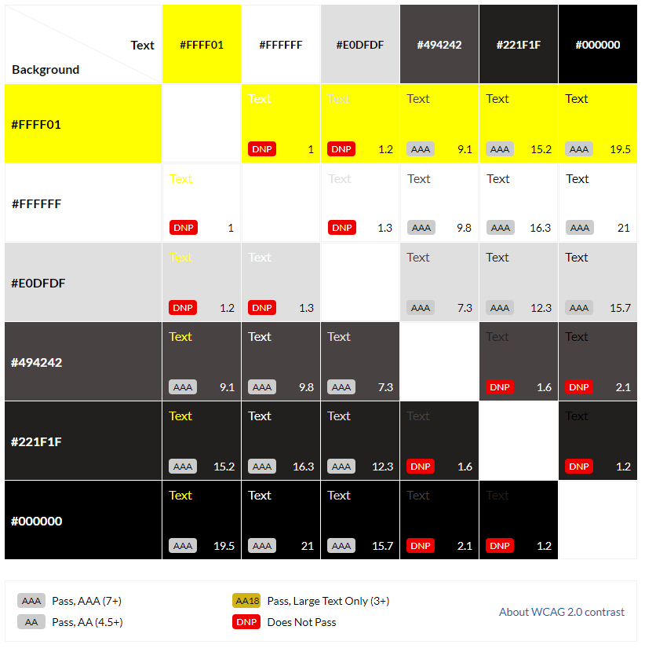

  * [Wireframes](#wireframes)
    + [Balsamiq Wireframes](#balsamiq-wireframes)
    + [PC [2560 x 1440]](#pc--2560-x-1440-)
    + [Laptop [1366 x 768]](#laptop--1366-x-768-)
    + [Tablet](#tablet)
    + [Mobile](#mobile)

# Features

 ## Site Structure and Features

  ### Home page

  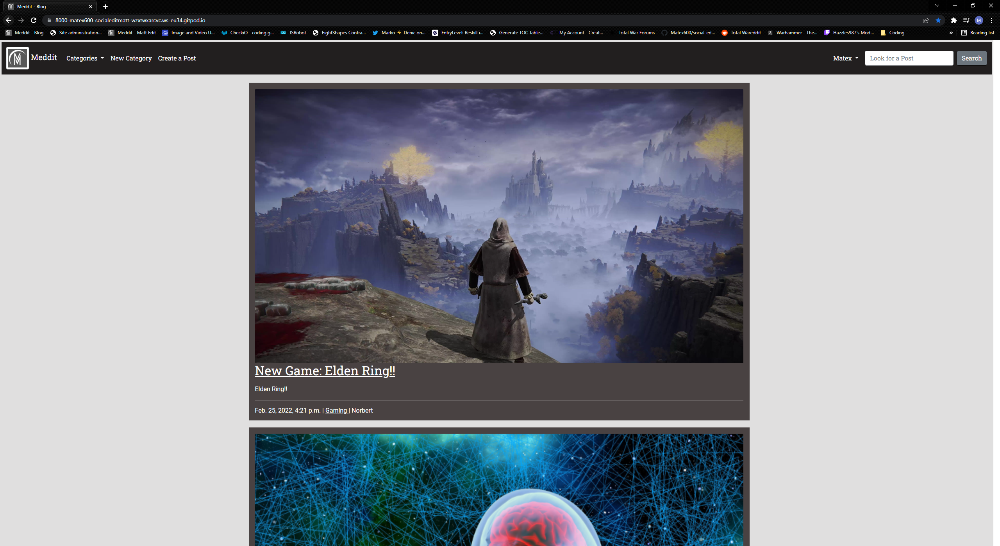

  #### Navbar 

  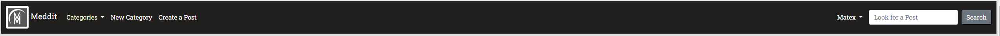

  #### Create Post 

  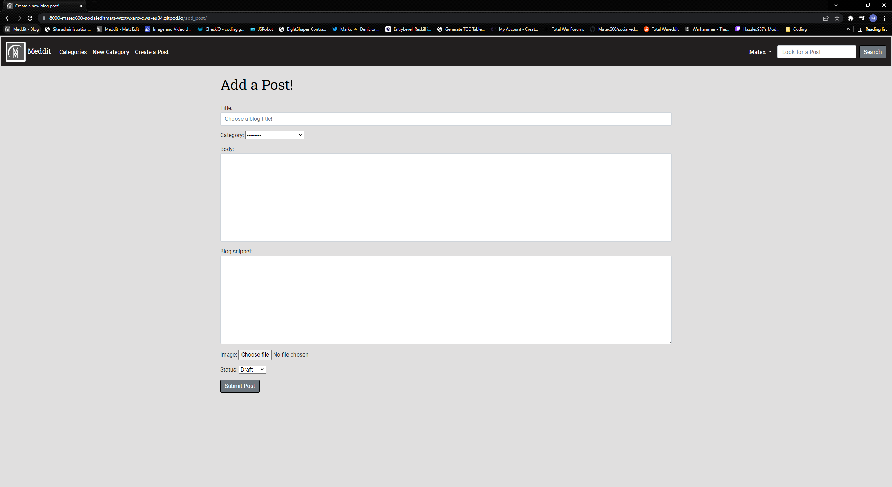
  
  #### Edit Post

  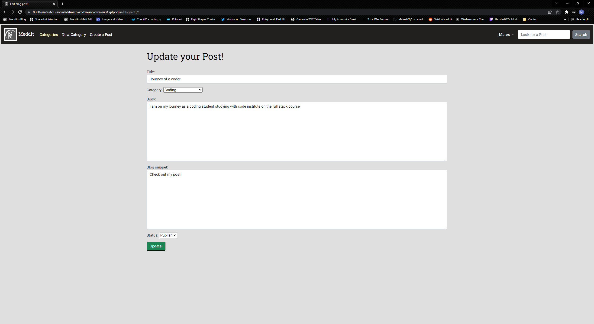

  #### New Category

  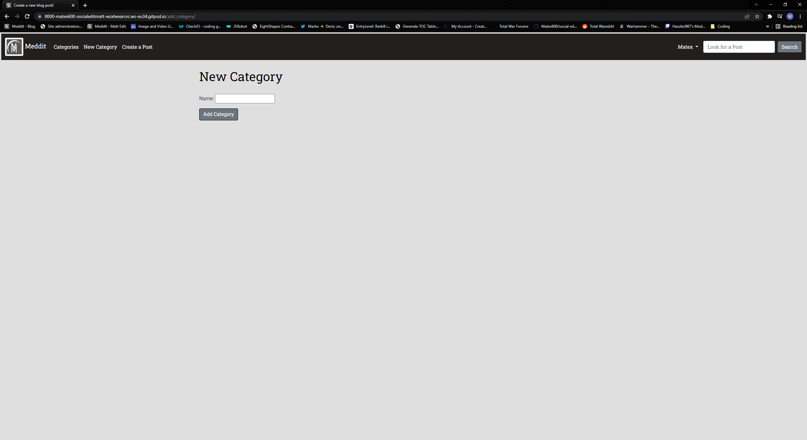

  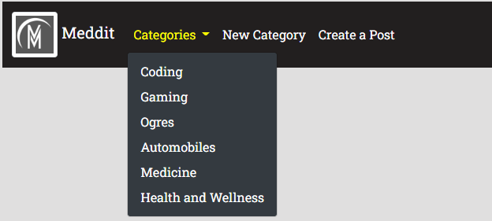

  #### User

  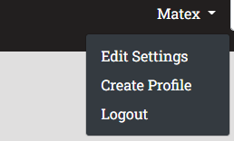

  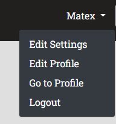

  

  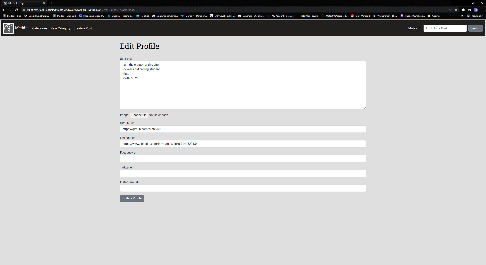

  #### Search Bar

  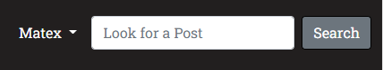

  ### Blog Page

  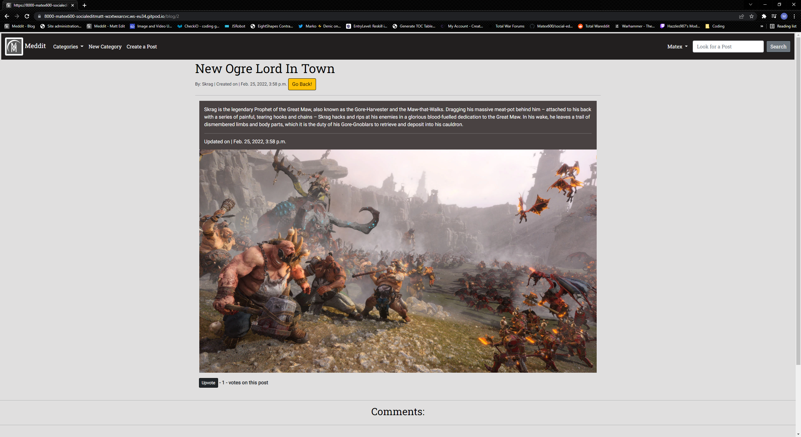

  #### Up/down Vote

  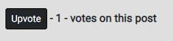

  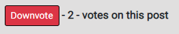

  #### Comments

  

  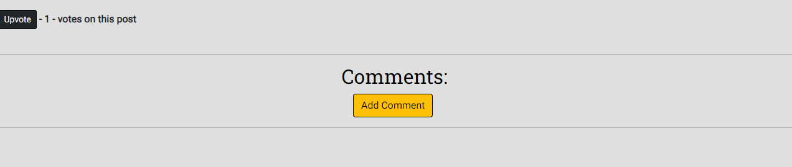

  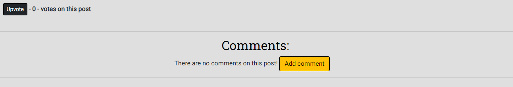

  #### Author Profile

  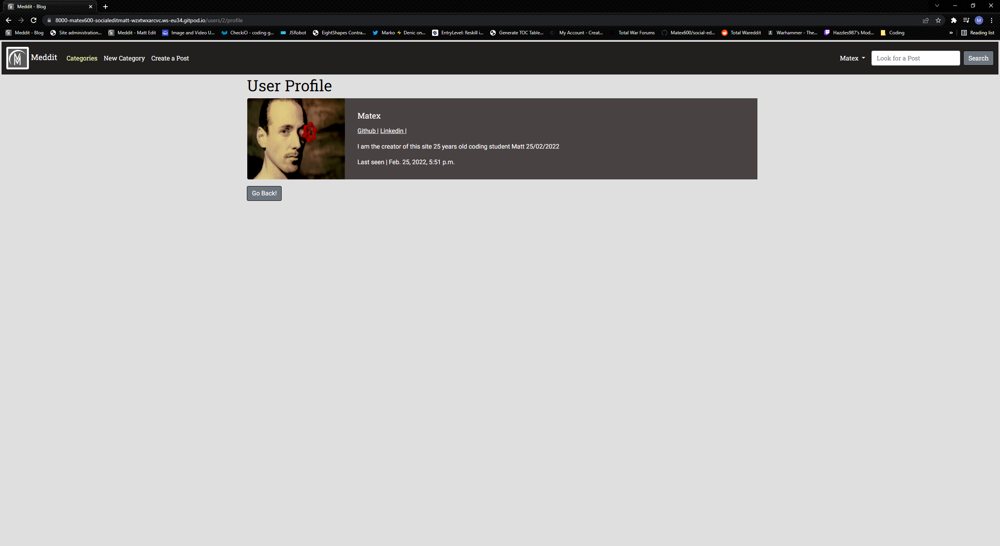


  ### Categories Page

  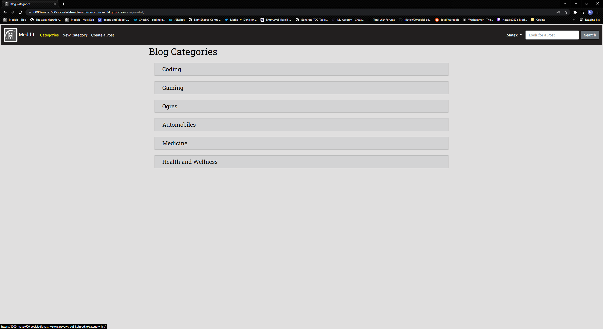

  ### Profile Page

  

  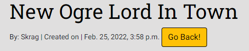

  ### Login Page

  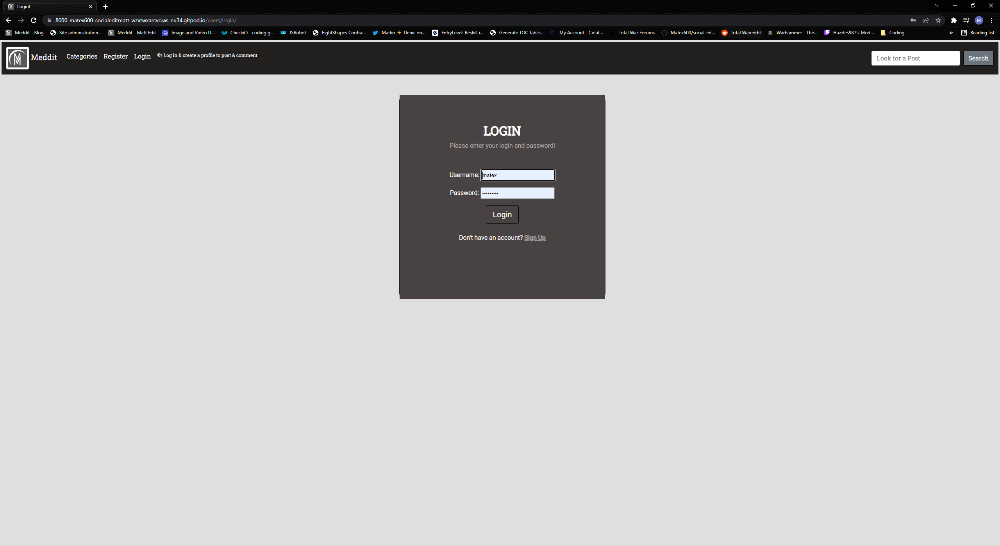

  ### Register Page

  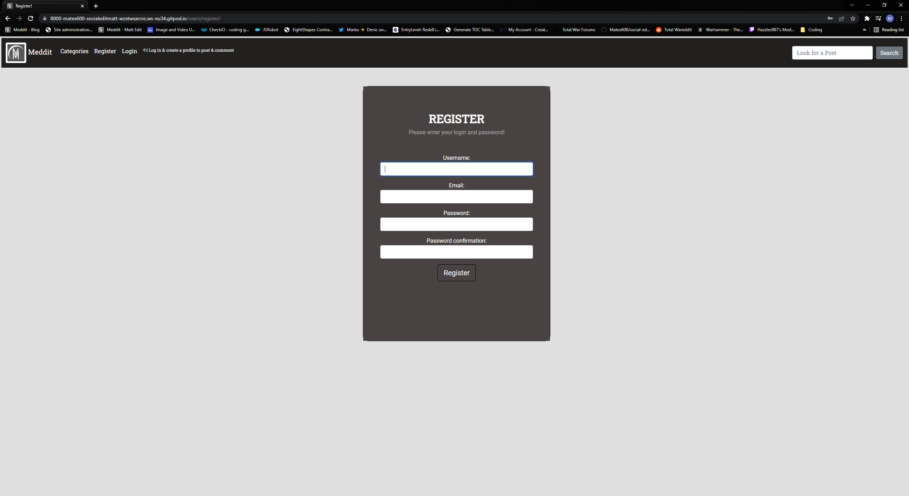

  ### Search page

  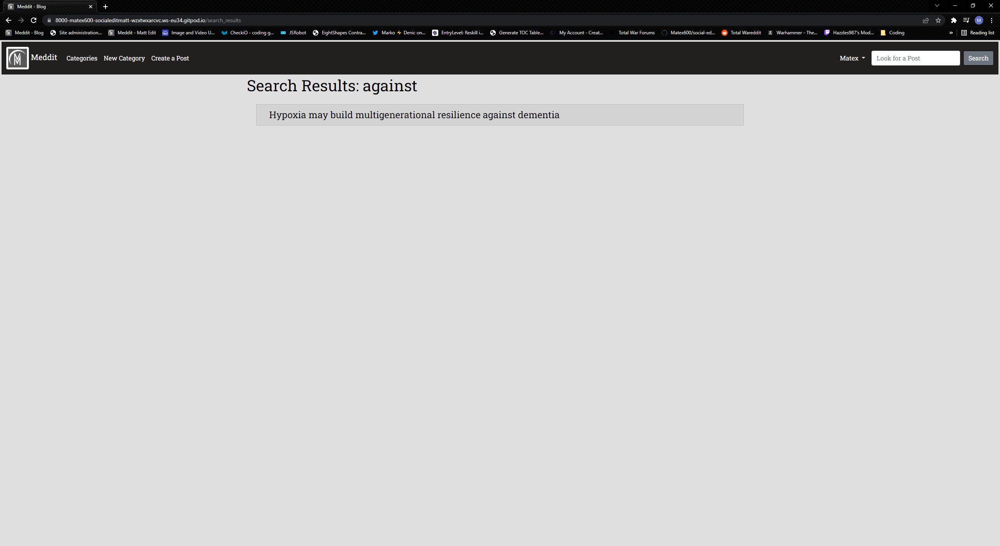


 ## Technologies Used
  * Coding Languages

    * [HTML5](https://en.wikipedia.org/wiki/HTML5). - Site structure.

    * [CSS3](https://en.wikipedia.org/wiki/CSS). - Site Design.

    * [Python3](https://en.wikipedia.org/wiki/Python_(programming_language)). - Used with Django.

* Libraries, Frameworks & Tools

  * [Django](https://www.djangoproject.com/) - Framework used to build the site and admin page.

  * [HerokuSQL](https://www.heroku.com/postgres) - Database used in the project.

  * [Python OS](https://docs.python.org/3/library/os.html). - Used for ```os.environ``` to help with automated development ```DEBUG```

  * [Markdown](https://en.wikipedia.org/wiki/Markdown). - Used for creating README.md document.

  * [Bootstrap 5](https://getbootstrap.com/). - Used for styling the site a framework addition to CSS3.

  * [Pylint](https://pylint.org/). - Analysing python code.

* Hosting Technologies

  * [Heroku](https://dashboard.heroku.com/login). - Deployment and hosting environment.

  * [Cloudinary](https://cloudinary.com/). - Storing images and static files.

  * [Github](https://github.com/). - Hosting Repository code.

* Testing Technologies
 

  * [W3C CSS3](https://jigsaw.w3.org/css-validator/). - Validate CSS

  * [DiffChecker](https://www.diffchecker.com/#). - Comparing code changes

# Testing

  ## Code Validation
  
  ### HTML
  * [Beautify](https://htmlbeautify.com/)

    * I have used html beautify to improve visibility of my code and format it for easy reading and as extensions in gitpod such as beautify and better jinja made the code broken in some cases.

 
    * 

  * [Bugs](#bugs)
   * ```
      DETAIL:  Key (slug)=() already exists.
     ``` 
     solution add null=True to slug model
- [Site Deployment](#site-deployment)
  * Deploying project to Heroku - [Live Link](https://project4-matt-ci.herokuapp.com/)
- [Cloning using Github](#cloning-using-Github)

    [Repository Link](https://github.com/Matex600/social-edit-matt)
    * Log in to Github.
    * Access my repository using above link.
    * In repository page select code next to Gitpod.
    * Button, make sure HTTPS is selected.
    * Click on the copy button on the right (Two overlapping squares)
    * Open a new workspace in Gitpod.
    * Once the workspace loads in the terminal type.
        ```
        git clone https://github.com/Matex600/social-edit-matt
        ```

- [Forking using Github](#Forking-using-Github)
    * You can contribute to this project without affecting the main branch with the following steps.
  1. Navigate to github repositores select this [repository](https://github.com/Matex600/social-edit-matt).
  2. On the right of the repository name you will find the fork button next to star and watch buttons.
  3. Pressing said button will create a copy for you to use.

- [Deployment using Heroku](#Deployment-usingHeroku)
  * Development Environment
    1. Create requirements.txt ```pip3 freeze --local > requirements.txt```
    2. Create Procfile containing application name ensure proper formatting or deploymentw will fail.
    3. Commit and push changes to Github.
    4. Move to Heroku part of deployment.

  * Heroku
    1. Create an account with [Heroku](https://signup.heroku.com/).
    2. Create a new app, with an appropriate region and name.
    3. In **Resources** add **Heroku Postgres**.
    4. Within your newly created app
    go to settings go to **Config Vars**
    use the **DATABASE_URL** Value and add it to your env.py file and connect it via settings.py.
    5. Create a **SECRET_KEY** Key and the Value as desired key.
    6. Next go to the **Deploy** tab next to **Deployment Method** click **GitHub** connect your account and repository.
    7. **Recommended** enable automatic deploys.
    8. At the Bottom of the page hit deploy branch making sure it is set to **main**

    #### **Note.**
    This project uses Python and has to be deployed with a hosting platform such as Heroku as it handles backend functionality.
 # Credits

 ## Media
  [Login/Register](https://mdbootstrap.com/docs/standard/extended/login). - Inspiration for login/register page.

  Placeholder User Image (Default User Image) this Image was made by myself in microsoft paint.

  [Site (M) Logo](https://www.creativefabrica.com/) I purchased this logo from Creative fabrica and have a license to use it.
 ## Acknowledgment
  * [Django Documentation](https://docs.djangoproject.com/en/3.2/). - Helping me understand Django better.

  * [Foreign Key Django](https://docs.djangoproject.com/en/3.2/topics/db/examples/many_to_one/).- This documentation guided me in creating a foreign key.

  * [Django for beginners](https://youtu.be/rHux0gMZ3Eg). - Thank you to programming with Mosh for helping me understand views and urls better.

  * [Python Django 7 course](https://www.youtube.com/watch?v=PtQiiknWUcI). - Thank you Traversy media for helping me learn more Django.

  * [Stack Overflow](https://stackoverflow.com/).- Stack Overflow helped me debug my application.

  * [Tutor Support](https://codeinstitute.net/).- Tutor support has been helpful, I have barely used it until this project but it has been very helpful and helped me understand a problem so I can solve it.

  * [Code Institute](https://codeinstitute.net/).- For preparing me for this project with their template and lessons.

  * [Balsamiq](https://balsamiq.com/wireframes/).- Wireframes for this project.

  * [Lucid Chart](https://www.lucidchart.com/pages/).- Logic Chart.

  * My mentor Maranatha Ilesanmi has helped me with improving the styling on my page and motivating me to push through any struggles I have had as well as offering useful advice on site layout. 
  * [Favicon](https://favicon.io/).- For converting my logo into a favicon.

  * [Fix NoReverseMatch](https://stackoverflow.com/questions/38390177/what-is-a-noreversematch-error-and-how-do-i-fix-it).- This article helped me fix a few of the errors I got 
  creating this blog.

  * [From CharField to ForeignKey](https://stackoverflow.com/questions/35999186/change-type-of-django-model-field-from-charfield-to-foreignkey). - This article helped me convert categories from Charfield to ForeignKey.

  * [StackOverflow | Safe](https://stackoverflow.com/questions/61819183/django-why-does-the-text-that-i-placed-in-django-summernote-displays-html-tags). - Fixed html escaping.

  * [Class has no Objects](https://youtu.be/BSKniGNL5CQ).- Thank you for this video guiding me to install pylint to resolve this issue.

  * [Fontawesome](https://fontawesome.com/).- Arrow icon in Navbar.

  * [Tutor support](https://codeinstitute.net/).- Helped me Reset my database twice during my project after having issues with database.