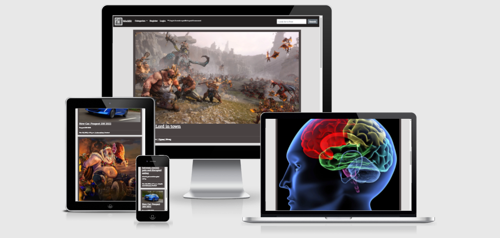

# Meddit - Blog

[Site Live link](https://project4-matt-ci.herokuapp.com/)

I recommend clicking any links found in this README with Ctrl + Left mouse click for (Windows) and Control + click (Mac) 
# Project Introduction

This website is a full-stack application using mainly the Django full-stack web framework.

My goal is to create a functioning and responsive Blog, that allows users can make blog posts. Users can also upvote and downvote as well as make comments.

The sites purpose is to allow users to connect and share things they find interesting like hobbies or news!

I have built this project with the future in mind, as I have many plans to expand, improve, modernise design, technology, styling, and features.

Project 4 for [CodeInstitute](https://codeinstitute.net/) Full-stack course (5P)


 * This project is created using:
  1. Django 3.2
  2. Heroku (Deployment)
  3. Heroku PostgresSQL
  4. Bootstrap 5
  5. Github (Repository Hosting)
  6. Gitpod (Development environment)

  * Blog site allowing users to:
  1. Create | Edit | Delete Posts
  2. Create | Categories
  3. Create | Comments
  4. Login | Register | Logout
  5. Create | Update | User Profile

# User Experience
  ### User Stories
  <hr>

  

  * I have taken an Agile approach to make my user stories and epics, I would like to greatly expand on this approach in future projects as I gain experience.
  
  

  Github issues and project were created according to the MoSCoW prioritization technique.

  <br>
  <hr>

  * Steps Taken:

    1. Created issue tags showing varying importance to the project.

    2. Created issues with tags: 'Must have' (Most important features) 'Should have' (Should be implemented) 'Could have' (Implement if there is time) 'Won't have' (Features that have been outside of current scope)

    3. Created Github Project (Old version) at the time of submission; a new version of the Github project has been released, I will implement this new version in future projects.

    4. I created a project with columns 'to do' (Work that needs to be done), 'In progress' (Feature in development), 'Done' (Feature complete and tested), 'Future content' (Content implemented post-release).

    5. I then assigned 'issues' to the project as development continued, making decisions along the way.

    ### Significace and Complexity 
    <hr>

    

    

    6. All of the above has been implemented successfully.

  ### User testing 
  <hr>


  * I have received feedback from my mentor on my project, and I decided to adjust some styling to improve card colors  for blog posts. I made them a lighter color to complement the rest of the site.

  * I have received feedback from my sibling, that enabled me to identify an issue with an image not aligning properly in the blog details therefore it has been patched.

  * I used the code review channel on slack and received feedback to help improve user experience, by adding an add post button if a category has no posts to make it easier for the user. This has been implemented.

  * I have tested the site functionality and created a non-admin account.

    * Testing:
      * login/register
      * creating post / category
      * commenting and liking posts

    All of these features worked as expected

  * I asked my sibling to assess the site functionality such as creating a post, category and after registering to test login functionality, and logout as well as creating and editing a profile, those features worked as expected.


  # Site Design

  ## Composition

  ### Fonts 
  <hr>

  * [Roboto](https://fonts.google.com/specimen/Roboto). - Font used for Body text.
  * [Roboto - Slab](https://fonts.google.com/specimen/Roboto+Slab?query=roboto+slab). - Font used for Header text.

  * I have chosen these two fonts, as they complement each other which additionally complement my blog.

  * Sans-Serif is used as a backup font in case one or both fail for any reason.
  ### Font Size
  <hr>

  * I have kept font size as default as I feel that it looks good, and what I wanted for the blog I have no need to change it.

  ### Color Scheme
  <hr>

  * color: #ffff01 | Highlighting Navbar links, for good accessibility and indicates to the user that they are hovering over a link.

  * color: #FFFFFF | Is used for text color within the navbar, blog titles on the index, blog description, date, time, author, and category.

  * In the blog detail, it is used for blog body text and user profile at foot of the page.

  * color: #E0DFDF | This color is used for the body (blog background) to compliment the other slightly darker color.

  * color: #494242 | I have chosen this color for the cards for individual blogs as I feel that it makes them stand out and be the center of attention.

  * color: #221f1f | I have chosen this color for the navigation bar as it is a darker gray than my other colors and is bold and makes the navigation stand out better.

  * color: #000000 I used this color for the tile of the blog details page to make it stand out as it's an important piece of the blog the information below the title is this color also to separate it from the body content.

    ### Color Pallet
    <hr>
    
    
    ### Blog card color
    <hr>

    

    ### Color grid
    <hr>

    

  ### Balsamiq Wireframes

  <hr>

  #### PC Wireframes
  
   * [Desktop](documentation/wireframes_updated/desktop)

  #### Laptop Wireframes

   * [Laptop](documentation/wireframes_updated/laptop)

  #### Tablet Wireframes

   * [Tablet](documentation/wireframes_updated/tablet)

  #### Mobile
   * [Mobile](documentation/wireframes_updated/mobile)

  #### Initial wireframes

   * [Old](documentation/wireframes_old)

# Features

 ## Site Structure and Features

  ### Home page

  

  #### Navbar 

  

  #### Create Post 

  
  
  #### Edit Post

  

  #### New Category

  

  

  #### User

  

  

  

  

  #### Search Bar

  

  ### Blog Page

  

  #### Up/down Vote

  

  

  #### Comments

  

  

  

  #### Author Profile

  


  ### Categories Page

  

  ### Profile Page

  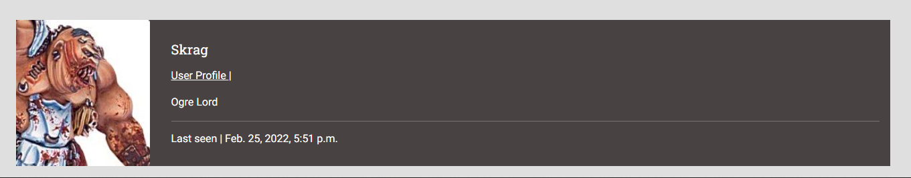

  

  ### Login Page

  

  ### Register Page

  

  ### Search page

  


  ## Database Models
  <hr>

  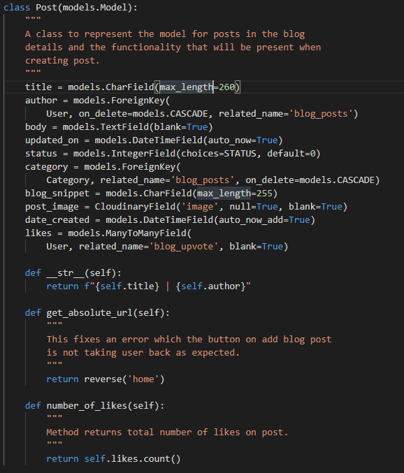

  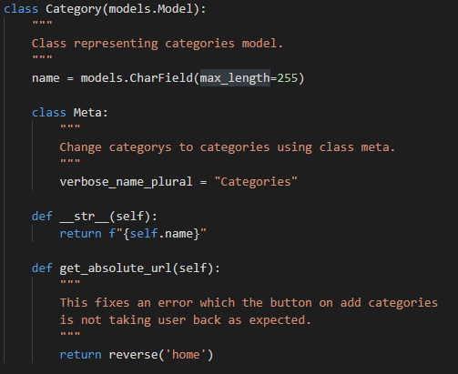

  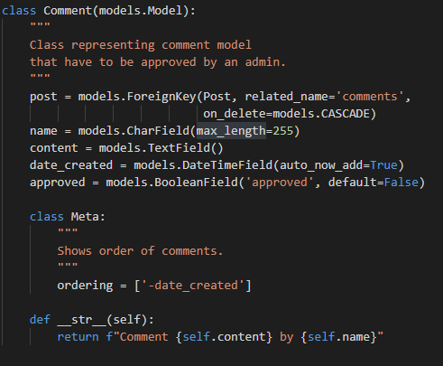

  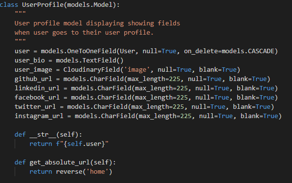

  <hr>

 ## Technologies Used
  * Coding Languages

    * [HTML5](https://en.wikipedia.org/wiki/HTML5). - Site structure.

    * [CSS3](https://en.wikipedia.org/wiki/CSS). - Site Design.

    * [Python3](https://en.wikipedia.org/wiki/Python_(programming_language)). - Used with Django.

* Libraries, Frameworks & Tools

  * [Django](https://www.djangoproject.com/) - Framework used to build the site and admin page.

  * [HerokuSQL](https://www.heroku.com/postgres) - Database used in the project.

  * [Python OS](https://docs.python.org/3/library/os.html). - Used for ```os.environ``` to help with automated development ```DEBUG```

  * [Markdown](https://en.wikipedia.org/wiki/Markdown). - Used for creating README.md document.

  * [Bootstrap 5](https://getbootstrap.com/). - Used for styling the site a framework addition to CSS3.

  * [Pylint](https://pylint.org/). - Analysing python code.

* Hosting Technologies

  * [Heroku](https://dashboard.heroku.com/login). - Deployment and hosting environment.

  * [Cloudinary](https://cloudinary.com/). - Storing images and static files.

  * [Github](https://github.com/). - Hosting Repository code.

* Testing Technologies

  * [Nu Html Checker](https://validator.w3.org/nu/#textarea). - Validate HTML

  * [W3C CSS3](https://jigsaw.w3.org/css-validator/). - Validate CSS

  * [DiffChecker](https://www.diffchecker.com/#). - Comparing code changes


# Testing

  # Manual Testing

  ## Registering

  Testing if you can try to register without filling out forms.

  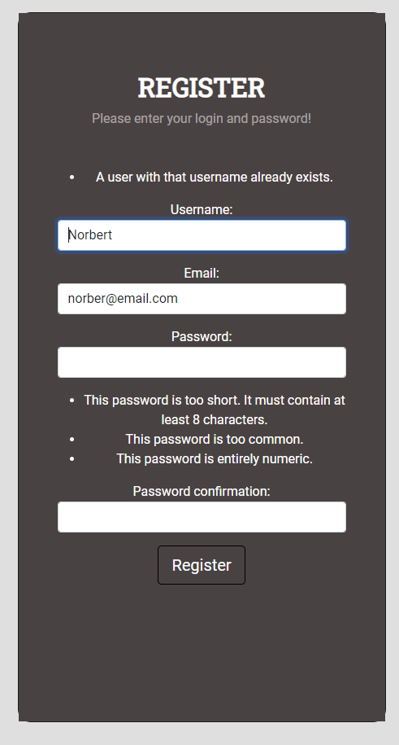


  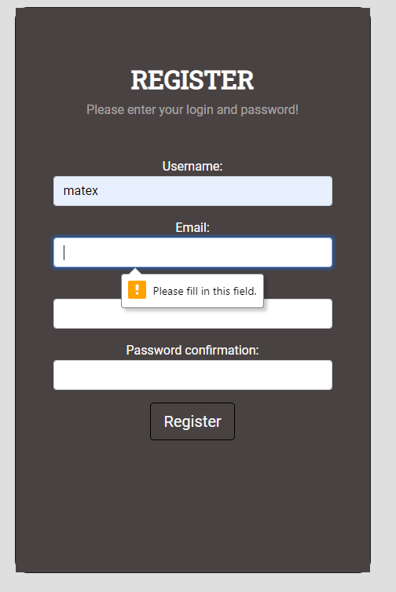


  ## Loging in 
   
   Testing login functionality to see if you can enter short password or existing username.

   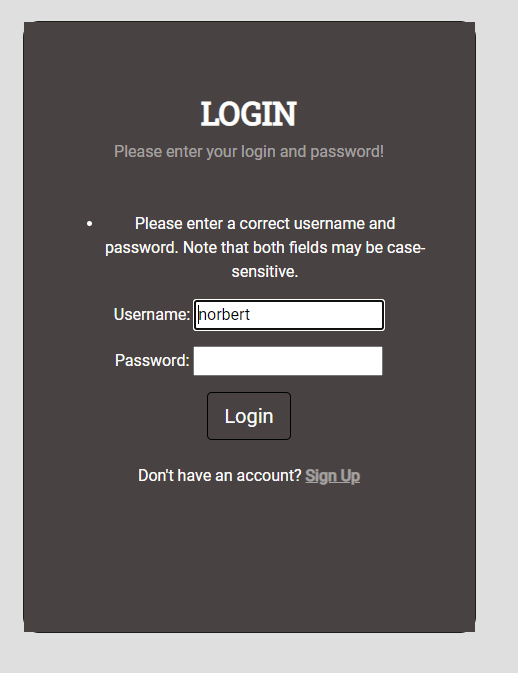

  ## Create post
   
   Testing to see if you can create a post without a snippet telling the user something about the post before they open a post.

   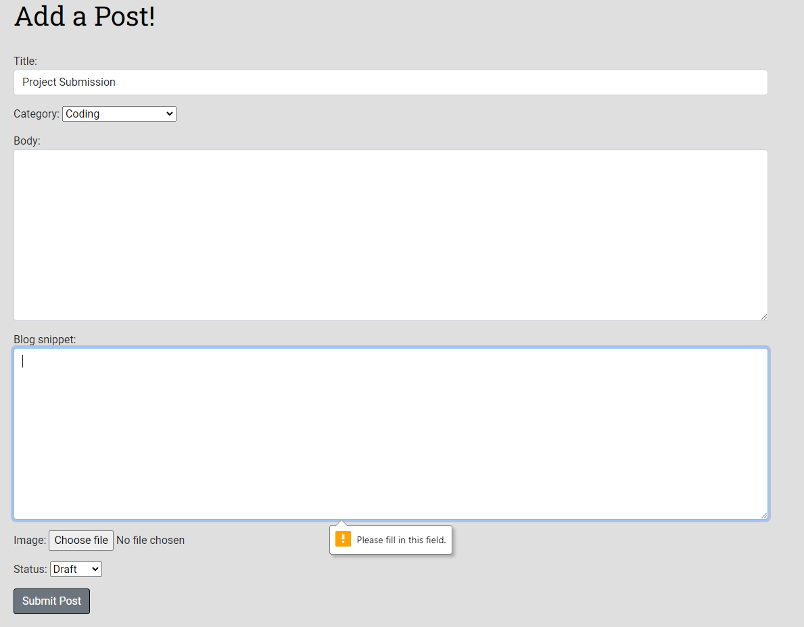

  ## Delete post

   Testing to see if you get prompted before deleting a post.

   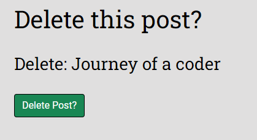

  ## Comment 

   Testing to see if you can post a comment, upvote, downvote and if a admin has to approve comment it .

  

  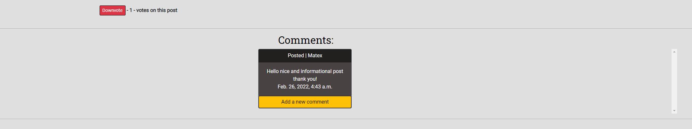


  # Code Validation
  
  ## HTML
  <hr>

  ### [Beautify](https://htmlbeautify.com/)

   * I have used HTML beautify to improve the visibility of my code and format it for easy reading and extensions in gitpod such as beautify and better jinja made the code broken in some cases.

  <br>


  ###  [Nu Html Checker](https://validator.w3.org/nu/#textarea)
  
  Passed all checks except update user as it uses a Django form and I am unable to fix these errors the page functions without problems.

  These files can be found [Here](documentation/testing/html)
  
  <br>

  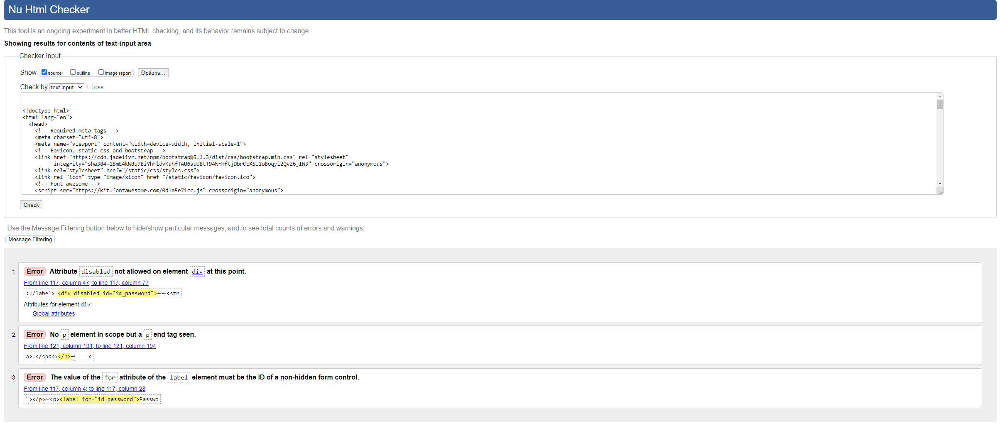
  

  ## Css
  <hr>

  <p>
  <a href="http://jigsaw.w3.org/css-validator/check/referer">
    
    </a>
  </p>

  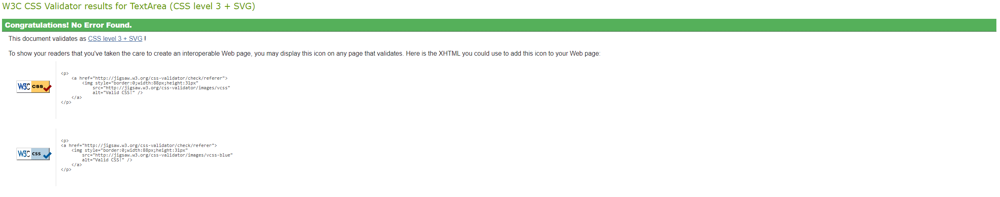
  
  ### Pep8

  All files passed pep8 tests

  #### Files tested:

  * meddit_users [Files](documentation/testing/pep8/meddit_users_pep8)

  * meddit_matt [Files](documentation/testing/pep8/meddit_matt_pep8)

  * meddit_blog_matt [Files](documentation/testing/pep8/meddit_blog_matt_pep8)

  
  <hr>

  # Bugs

  ## Squashed Bugs

  1. Database bug unable to migrate models.

     * Cause = Unknown

     * Fix = Reset database

     * Commands in the development process

  2. Categories not appearing for 20+ minutes in Create a Post.

     * Cause = category Charfield in Post model

     * Fix = Change Charfield to Foreign key, update URLs, views, and templates

     * Images in the development process

  3. NoReverseMatch multiple templates

     * Cause = View does not reverse after action

     * Fix = Add reverse to views and from django.urls import reverse_lazy, reverse
  
  4. Django f"" not working properly in Admin panel

     * Cause = Author field not in list_display

     * Fix = Add Author to list_display

  5. Button not changing color when upvoting or downvoting

     * Cause = Incorrect syntax if statement in template

     * Fix = Fix syntax in if statement and add else statement
  
  6. Html escaping into the browser from ```{{ post.body }}```

     * Cause = Unknown

     * Fix =  ```{{ post.body | safe }}```

  7. Cloudinary files not working when creating a post

     * Cause = Incorrectly set up cloudinary path

     * Fix = DEFAULT_FILE_STORAGE = 'cloudinary_storage.storage.MediaCloudinaryStorage'

  ## Remaining Bugs

   ### None spotted

  ## Security 

  I have set debug to be automatic using the following.
  * settings .py
      ```
      SECURITY WARNING: don't run with debug turned on in production!

      DEBUG = "DEVELOPMENT" in os.environ
      ```
  * env.py
      ```
      os.environ["DEVELOPMENT"] = "True"
      ```
  * urls.py
      
      ```
      from django.conf import settings

      from django.conf.urls.static import static

      urlpatterns = [ path(...... ] + static(settings.STATIC_URL, document_root=settings.STATIC_ROOT)
      ```
 # Development Process
  

  ## Week 1 - Project Conception
  Time spent daily: 2-3 hours
  ### Project Conception
  <br>
  Development began with, opening a repository with code institutes github template, and installing all required packages, libraries, frameworks, connecting to Heroku PostgreSQL. 

  This followed by constructing a github project, 'issues' and their corresponding tags, and adding 'issues' to corresponding columns.

  After this, I created the initial wireframing for the site structure along with making a logic diagram.

  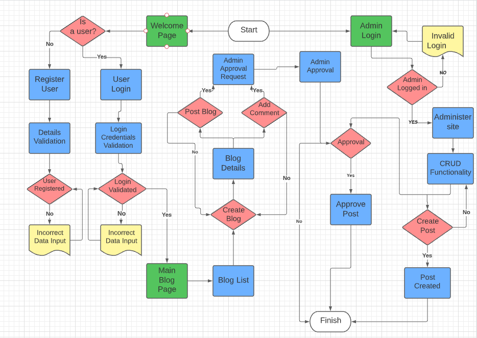


  <hr>

  ## Week 2 
  Time spent daily: 3-4 hours
  ### Crud | Database Reset
  <br>

  Phase 2 of development began with creating starting a Django project and app with settings setup and initial deployment.
  
  The early deployment was to avoid issues further down the line, being granted the ability to debug deployment failures with ease.

  In this phase, I added some basic CRUD functionality with creating, editing, and deleting posts by creating the Post model and @admin.register function.

  While developing I made sure to follow the agile development process. 

  I began using bootstrap and created templates to display posts in basic form along with a functional navbar.

  As well as an early version of authentication with logging in registering and logging out and fixing issues.

  In this phase, I encountered a major bug in my database, where I could not make migrations after spending a considerable amount of time I decided to reset the DB and start over with creating test posts and categories.

  Code used to reset the database

    ```

      heroku login 

      heroku apps
  
      heroku pg:reset DATABASE --app
   
      appname

      touch reset.py

      python3 reset.py

      python3 manage.py createsuperuser

    ```

  <hr>

  ## Week 3 
  Time spent daily: 4-6 hours
  ### Troubleshooting | Categories
  <br>
  
  Development Phase 3 began with an increase to my availability, in this phase I added the ability to add an ordered category and link blog pages to their categories.

  As well as adding categories dropdown to navigation and authenticating users to limit only logged-in users to create posts.

  During this phase, I also added functional upvote and downvote buttons.

  Phase 3 in development brought in a lot of issues, I experienced a large share of errors when testing out functionality and had to spend a lot of time researching and debugging the application, Which slowed the process considerably.

  <hr>

  ## Week 4 
  Time spent: 5-6 hours daily
  ### Functionality | Styling
  <br>
  
  Phase 4 of development added most of the styling and most final functionality and styling to Posts, Categories, Likes.

  In this phase, I created the 'User-profile' page with the ability for the user to edit profile settings and information.

  In addition, I created functionality for changing user passwords, uploading user images to profiles and posts with cloudinary.

  I struggled with the ``` NoReverseMatch ``` error I was able to fix this by modifying templates, urls, and views.

  Furthermore, I enabled users to create comments and post comments that are approved by an Administrator.

  As well as styling the Login and register page to the final design stage.

  <hr>

  ## Week 5
  Time spent: 8-10 hours daily
  ### Code Cleanup | Final Design | README

  Development phase 5 began with the final styling of the website and using bootstrap to create a grid system to place all site components uniformly.

  In addition to this, I tested the site manually as well as asked family, friends and fellow students to help me test site functionality, This allowed me to make some crucial changes to improve overall design and functionality.

  I encountered a problem with categories not appearing for 20-30 minutes when creating one in the Heroku deployed site I resolved this by destroying and replacing the Database and changing category in the post model to a Foreignkey from a Charfield, migrating a new database and remaking views, urls and templates to accommodate foreign keys.

  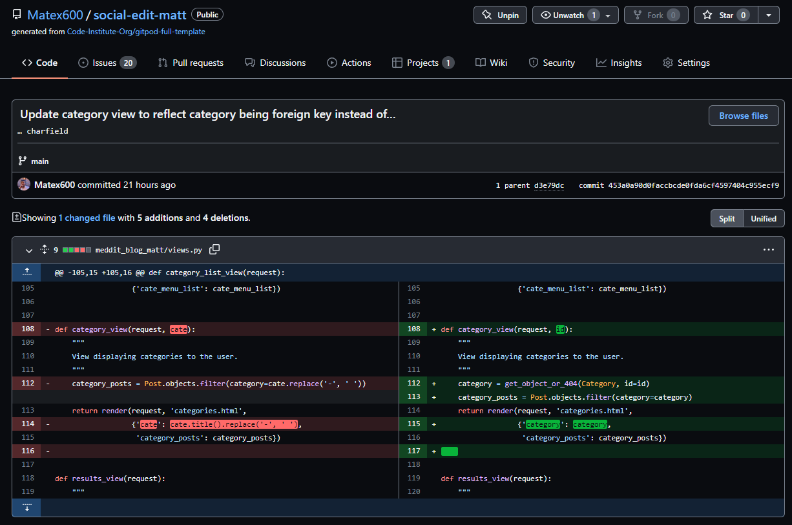

  <br>
  <hr>

  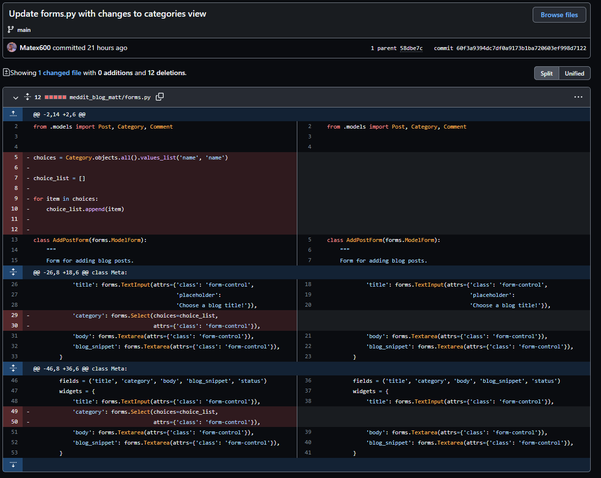

  <br>
  <hr>

  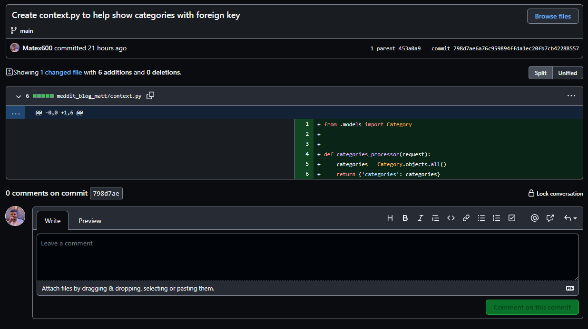

  <br>
  <hr>

  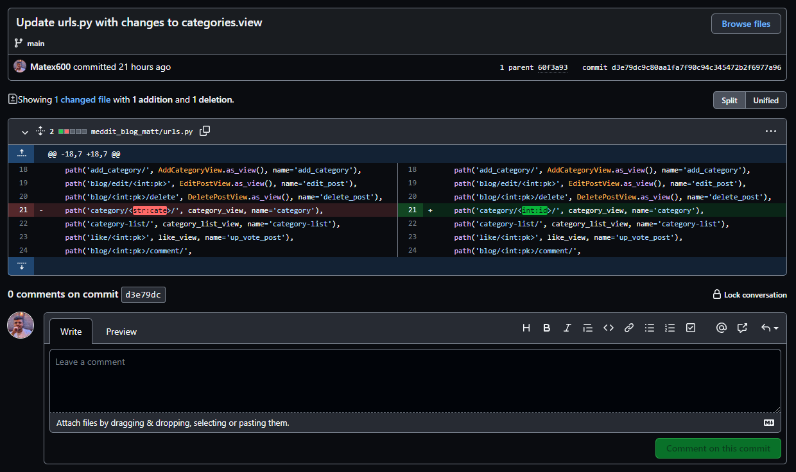

  The above problem took up most of this development phase.

  Therefore I dedicated my remaining time to completing README.md document and final touches.

  <hr>
  <br>

 # Cloning using Github

  [Repository Link](https://github.com/Matex600/social-edit-matt)

  * Log in to Github.
  
  * Access my repository using the above link.

  * In the repository page select code next to Gitpod.

  * Button, make sure HTTPS is selected.

  * Click on the copy button on the right (Two overlapping squares)

  * Open a new workspace in Gitpod.

  * Once the workspace loads in the terminal type.
        ```
        git clone https://github.com/Matex600/social-edit-matt
        ```

 # Forking using Github
  * You can contribute to this project without affecting the main branch with the following steps.

  1. Navigate to github repositores select this [repository](https://github.com/Matex600/social-edit-matt).

  2. On the right of the repository name you will find the fork button next to the star and watch buttons.

  3. Pressing said button will create a copy for you to use.

 # Deployment using Heroku

  * Development Environment

    1. Create env.py it needs to contain these 4 variables.

      * Cloudinary can be obtained here [URL](https://cloudinary.com/)

      * Secret key is a password of your choosing make it a strong one [KEY](https://djecrety.ir/)

      * Obtain Heroku postgreSQL [HERE](https://dashboard.heroku.com/apps)

        ```
        import os

        os.environ['DATABASE_URL'] = 'postgres: '...'

        os.environ['SECRET_KEY'] = '...'

        os.environ['CLOUDINARY_URL'] = '...'

        os.environ["DEVELOPMENT"] = "True"

        ```

    2. Create requirements.txt ```pip3 freeze --local > requirements.txt```
    
    3. Create Procfile containing application name to ensure proper formatting or deployment will fail.

    4. Commit and push changes to Github.

    5. Move to Heroku part of deployment.

  * Heroku
    6. Create an account with [Heroku](https://signup.heroku.com/).

    7. Create a new app, with an appropriate region and name.

    8. In **Resources** add **Heroku Postgres**.

    9. Within your newly created app
    go to settings go to **Config Vars**
    use the **DATABASE_URL** Value and add it to your env.py file and connect it via settings.py.

    10. Create a **SECRET_KEY** Key and the Value as the desired key.

    11. Next go to the **Deploy** tab next to **Deployment Method** click **GitHub** connect your account and repository.

    12. **Recommended** enable automatic deploys.

    13. At the bottom of the page hit deploy branch making sure it is set to **main**

    #### **Note.**

    This project uses Python and has to be deployed with a hosting platform such as Heroku as it handles backend functionality.

 # Credits

 ## Media

  * [Login/Register](https://mdbootstrap.com/docs/standard/extended/login). - Inspiration for login/register page.

  * Placeholder User Image (Default User Image) this Image was made by myself in microsoft paint.

  * [Site (M) Logo](https://www.creativefabrica.com/) I purchased this logo from Creative fabrica and have a license to use it.
 ## Acknowledgment
  * [Django Documentation](https://docs.djangoproject.com/en/3.2/). - Helping me understand Django better.

  * [Foreign Key Django](https://docs.djangoproject.com/en/3.2/topics/db/examples/many_to_one/).- This documentation guided me in creating a foreign key.

  * [Django for beginners](https://youtu.be/rHux0gMZ3Eg). - Thank you to programming with Mosh for helping me understand views and urls better.

  * [Python Django 7 course](https://www.youtube.com/watch?v=PtQiiknWUcI). - Thank you Traversy media for helping me learn more Django.

  * [Stack Overflow](https://stackoverflow.com/).- Stack Overflow helped me debug my application.

  * [Tutor Support](https://codeinstitute.net/).- Tutor support has been helpful, I have barely used it until this project but it has been very helpful and helped me understand a problem so I can solve it.

  * [Code Institute](https://codeinstitute.net/).- For preparing me for this project with their template and lessons.

  * [Balsamiq](https://balsamiq.com/wireframes/).- Wireframes for this project.

  * [Lucid Chart](https://www.lucidchart.com/pages/).- Logic Chart.

  * My mentor Maranatha Ilesanmi has helped me with improving the styling on my page and motivating me to push through any struggles I have had as well as offering useful advice on site layout. 
  * [Favicon](https://favicon.io/).- For converting my logo into a favicon.

  * [Fix NoReverseMatch](https://stackoverflow.com/questions/38390177/what-is-a-noreversematch-error-and-how-do-i-fix-it).- This article helped me fix a few of the errors I got 
  creating this blog.

  * [From CharField to ForeignKey](https://stackoverflow.com/questions/35999186/change-type-of-django-model-field-from-charfield-to-foreignkey). - This article helped me convert categories from Charfield to ForeignKey.

  * [StackOverflow | Safe](https://stackoverflow.com/questions/61819183/django-why-does-the-text-that-i-placed-in-django-summernote-displays-html-tags). - Fixed html escaping.

  * [Class has no Objects](https://youtu.be/BSKniGNL5CQ).- Thank you for this video guiding me to install pylint to resolve this issue.

  * [Fontawesome](https://fontawesome.com/).- Arrow icon in Navbar.

  * [Tutor support](https://codeinstitute.net/).- Helped me Reset my database twice during my project after having issues with database.